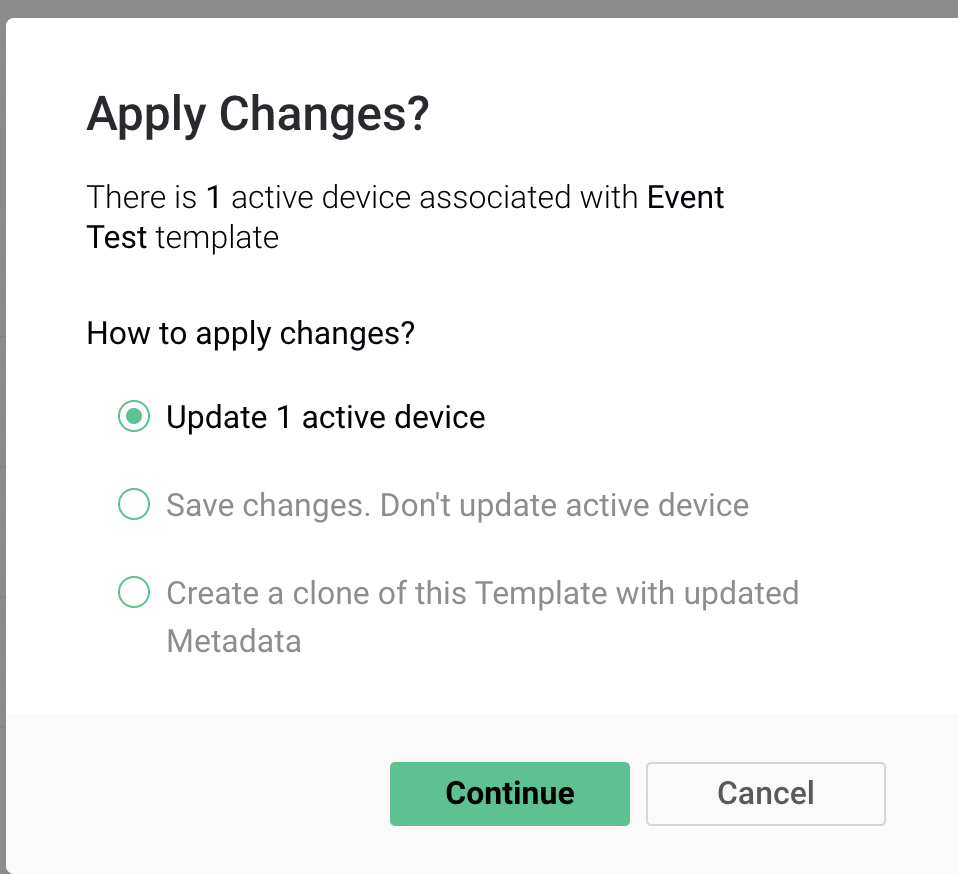

# Events Tutorial

Events show the current status of the device on the [Timeline](../web-dashboard/search/devices-1/device-view/timeline.md) in historical order.  
This feature is extra handy for monitoring informational, warning, and critical states of the Devices.

### 1. [Create a Template](working-with-templates/) or use an existing one

### 2. [Create the Device](../web-dashboard/search/devices-1/#create-device) that will be used with this Template


### 3. Create Events 

\(also this could be done at Template creation stage\)

Return to Template settings and open Events tab and click Edit at top right.  
_**Note:**_ there are two default events \(and they can't be edited\): Online and Offline.


#### Let's create 2 events with names Hello and Error

1. Click **Add New Event**
2. Provide information on the ****[**General tab**](../web-dashboard/products/events/general.md)\*\*\*\*
3. Name the first event with the name Hello
4. Click **Create** \(the event will appear in the Events tab list\)
5. Repeat the previous step for the second event with the name Error
6. Click **Save** to save and apply the changes made \(select Update active device this time\)




### 4. Check Events to be applied.

There are 2 ways to trigger events, we'll cover both ways.

#### Blynk.logEvent\(\) hardware command. 

Just call the function in the corresponding place of your sketch like this:

```text
Blynk.logEvent("hello");
```

There is also a way to send a description along with events:

```text
Blynk.logEvent("error","something went wrong");
```

#### Another way to send events is to use the HTTPS API

1. Navigate to the Device you've created
2. Click on its name
3. Open Device Info tab
4. Find Auth Token there and copy it to the clipboard


### 5. Paste Auth Token into the request body and send a request using a browser














it's taken from Device Info tab





it's taken from Event Code field










```

```





6. repeat the same with code=error  
7. check [Device Timeline](../web-dashboard/search/devices-1/device-view/timeline.md)


Congratulations! We have 2 events now!

Also we can mark Critical and Warning events as resolved after it's fixed. Please mind to comment this action in the modal window appeared.


From now on this event can be found under Resolved filter tag.

