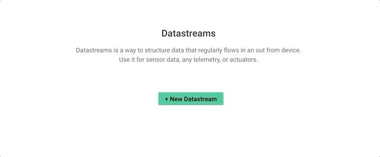
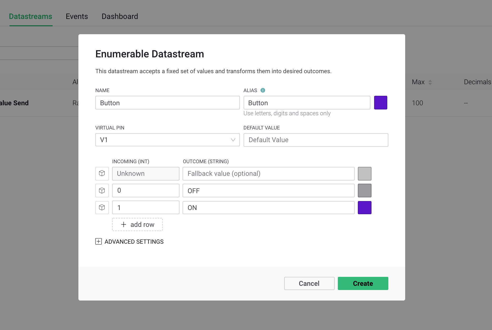

# Device Template Quick Setup

Device Template is a set of configurations inherited by devices of a similar type. 

Think about smart home switches. They all perform a similar function and it's safe to assume that they should have the same data model, GPIOs, firmware code, etc. If you would need to introduce changes to all of these devices, instead of editing each of them you could just edit a Device Template and all devices will be updated.

## Tutorial Overview

Device Template has a lot of settings, but in this tutorial, we will focus only on the most important things you can set up quickly.

At the end of this tutorial, you will have your first working device which will:

* send random values to the web and mobile dashboard in intervals
* receive user input from the web or mobile dashboard 


You would need a development board \(e.g. Node MCU, Arduino\). List of supported boards can be found here.


Full documentation on all of the Template settings can be found [here](../web-dashboard/products/porducts-management.md):



## 1. Edit/Create Template

Open the Templates section in the left menu and click **+ New Template** button**.** If you already have a template - click to open it and press **Edit** button.

## 2. **Basic** Settings

Give your new template a name,  specify the hardware and connectivity you will be using.


 If you can't find your hardware in the list choose **Generic Board**


## 3. Find **Template ID**

A new Template was created. On this screen notice **Template ID** and **Firmware Configuration** sections. You will need these details later in your sketch.  

## 4. **Add First Datastream**

For the goal of this tutorial skip the Metadata Tab and go to Datastreams tab. 

Datastreams are channels that are used to send data between the device and Blynk.Cloud. We will be using this Datastream to send random values from your device.

Click on **Add Datastream** button. Choose **Virtual Pin** in the dropdown menu:   

Set up the Datastream like this: 

* **Name:** Random Value Send
* **Virtual Pin:** V0
* **Data Type:** Integer
* **Min/Max:** 0/100

Skip all the other settings. When done, press Create and the new Datastream will be created.

These settings mean that all the devices that inherit this Template will process `integers` in the range  of  `0 to 100` through a `Virtual Pin V0`

## 4. **Add a Second Datastream**

Click on **Add Datastream** button again. Choose **Enumerable** type in the dropdown menu and set up the Datastream. We will be using this Datastream to send a value from mobile and web dashboards to the device.

* **Name:** Button
* **Virtual Pin:** V1
* Add **Row1:** 0, OFF
* Add **Row2:** 1, ON

Skip all the other settings and press **Create**

These settings mean that all devices that inherit this Template will process values `integers` in the range  of  `0 to 1` through a `Virtual Pin V1`and Blynk will interpret `0` as `OFF` and `1` as `ON` 

## 5. **Set Up Web Dashboard**

Go to Dashboard Tab and drag-n-drop these widgets to the canvas. 

* Switch
* Label
* Chart

#### 

### Set Up Switch Widget

Hover on the widget and you will see a gear button. This will open widget settings. Set up widget like this: 

### 

### Set Up Label Widget:

### 

### Set Up Label Widget:

## 5. **Set Up Mobile Dashboard**

## Link mobile dashboard with your product:

1. Open [Blynk.App](../mobile-applications/overview.md)
2. Log In to your account
3. Switch to [Developer Mode](developer-mode/)
4. Add a new Template 
5. Link it to your Product 
6. Add the widgets you need and assign them Datastreams
7. Publish the changes 

## Configure your board:

1. Open Dynamic Provisioning Template: - [ESP8266 ](https://github.com/blynkkk/blynk-library/tree/master/examples/Blynk.Inject/Template_ESP8266)- [ESP32 ](https://github.com/blynkkk/blynk-library/tree/master/examples/Blynk.Inject/Template_ESP32)- [MKR1000 ](https://github.com/blynkkk/blynk-library/tree/master/examples/Blynk.Inject/Template_MKR1000)- [MKR1010](https://github.com/blynkkk/blynk-library/tree/master/examples/Blynk.Inject/Template_MKR1010) 
2. Specify [TMPLID](https://docs.blynk.io/en/web-dashboard/for-developers/products/info/template-ids), [SSID WiFi](../web-dashboard/products/info/hotspot-prefix.md) and Board Name in the [sketch](activating-devices/)
3. Flash this template to your board

### Congratulations, you have configured your Product and it is ready to use!

Now all that remains is to [add your test board using Blynk.App](../mobile-applications/device-management/add-new-device.md), make sure it works as you expect, and integrate your code.

 

