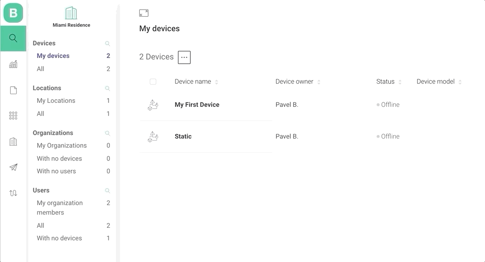

# Template Quick Setup

**Device Template** is a set of configurations inherited by devices of a similar type.

Think about smart home switches. They all perform a similar function and it's safe to assume that they should have the same data model, GPIOs, firmware code, etc. If you would need to introduce changes to all of these devices, instead of editing each of them you could just edit a Device Template and all devices will be updated.

## Tutorial Overview

While Device Template has a lot of settings, in this tutorial, we focus only on the most important settings to get your devices up and running quickly. By the end of this tutorial, you should have your first working device which will:

* send random values to the web and mobile dashboard in given intervals
* receive user input from the web or mobile dashboard UI elements


You would need a development board \(e.g. Node MCU, Arduino\). List of supported boards can be found here.


Full documentation on all of the Template settings can be found [here](../../blynk-console/products/porducts-management.md):



## **1. Enable Developer Mode**

Before moving further, make sure that you have **Developer Mode** enabled:

1. In the Blynk app or in Blynk.Console
2. Navigate to **My Profile** / **User profile** in the left menu
3. Check that **Developer Mode** switch is set to ON


Currently, **only one developer is allowed per Organization** to avoid sync issues. This limit can be changed later.


## 2. Edit/Create Template

Open the Templates section in the left menu and click **+ New Template** button**.** If you already have a template - click to open it and press **Edit** button.

## 3. **Basic** Settings

Give your new template a name, specify the hardware and connectivity you will be using.


If you can't find your hardware in the list choose **Generic Board**


## 4. Find **Template ID**

A new Template is now created. On this screen notice **Template ID** and **Firmware Configuration** sections. You will need these details later in your sketch.

## 5. **Set Up Mobile Dashboard**

1. Open [Blynk.App](../../blynk.app/overview.md)
2. Log In to your account
3. Switch to [Developer Mode](../developer-mode.md)
4. Find a template you just created on the web and tap on it.

## Configure your board:

1. Open Dynamic Provisioning Template: - [ESP8266 ](https://github.com/blynkkk/blynk-library/tree/master/examples/Blynk.Inject/Template_ESP8266)- [ESP32 ](https://github.com/blynkkk/blynk-library/tree/master/examples/Blynk.Inject/Template_ESP32)- [MKR1000 ](https://github.com/blynkkk/blynk-library/tree/master/examples/Blynk.Inject/Template_MKR1000)- [MKR1010](https://github.com/blynkkk/blynk-library/tree/master/examples/Blynk.Inject/Template_MKR1010) 
2. Specify [TMPLID](https://docs.blynk.io/en/blynk-console/for-developers/products/info/template-ids), [SSID WiFi](../../blynk-console/products/info/hotspot-prefix.md) and Board Name in the [sketch](../activating-devices/)
3. Flash this template to your board

### Congratulations, you have configured your Product and it is ready to use!

Now all that remains is to [add your test board using Blynk.App](../../blynk.app/device-management/add-new-device.md), make sure it works as you expect, and integrate your code.

