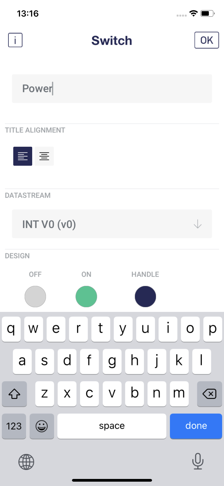
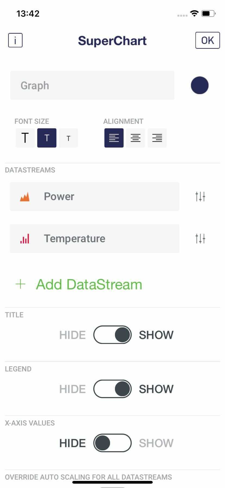

# Set Up Mobile App Dashboard

Now let's set up the mobile UI for our device.

In Blynk you can build different dashboards for the web and for the mobile app. Because screen sizes are different, you can adapt the interface to make it user-friendly.  

You would need Blynk mobile app for iOS or Android to continue.

## Switch to Developer Mode

Click on the Wrench Icon to switch to Developer mode. There you should see your template\(s\). Now you can configure how your devices should work in the mobile app. 

Tap on the template you would like to work with.

## Choose the Tile Design

When you are working with the Mobile Dashboard for the first time you can choose how devices will be shown in the list of devices when it's added. 

There are currently 6 Tiles presets with different interactions: 

* **Default** – shows Datastream value in the tile \(e.g.: temperature, volume, percentage, etc.\)
* **Icon Button** – tap on the Device Tile will trigger an action or switch ON/OFF state
* **Icon Level** – displays a certain level \(brightness, power, etc.\) based on selected Datastream value
* **Color Brightness** – allows to view and edit Color, Power status, and Brightness level of the Device
* **Image** – shows Icon or Image on the Tile. No quick actions. 
* **3 Labels** – it's a hybrid of Default and Icon Button. You can display up to 3 important values.

Choose the Icon Button Template  

The template settings will open. Select the datastream that will be linked to the button action. 

Select the Button mode - Switch. It will allow switching controlling the state of the datastream when tapping the device tile. Press OK.

## Create Mobile Dashboard

Now you can start building a mobile UI for your device. Tap anywhere on the canvas and add these widgets: 

* Switch
* Labeled Value
* Chart

### Switch Widget Settings

Give it a title, select the datastream

### Labeled Value Settings

For example, you want to show a temperature in the labeled value widget.   
Pick a datastream for temperature, also you can define a text before or after the value

### 

###  Chart Widget Settings

Now choose a SuperChart widget, set up 2 datastreams for example for power and temperature.   

Now your template is ready. Let's finish with the sketch and make it work.  
  

