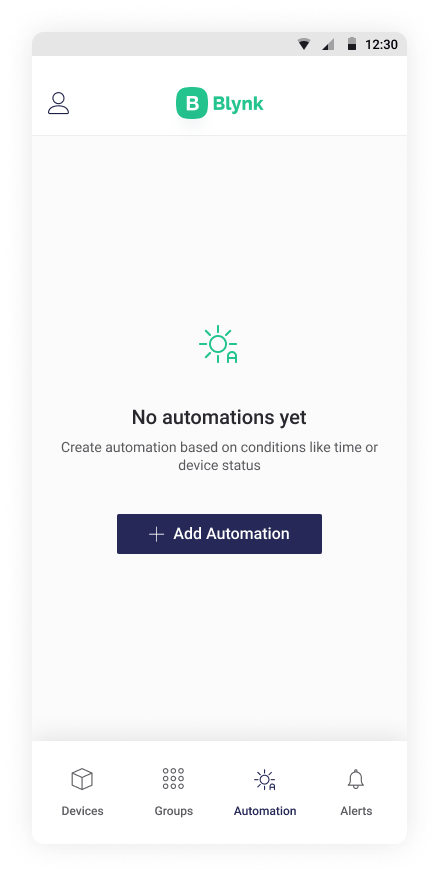
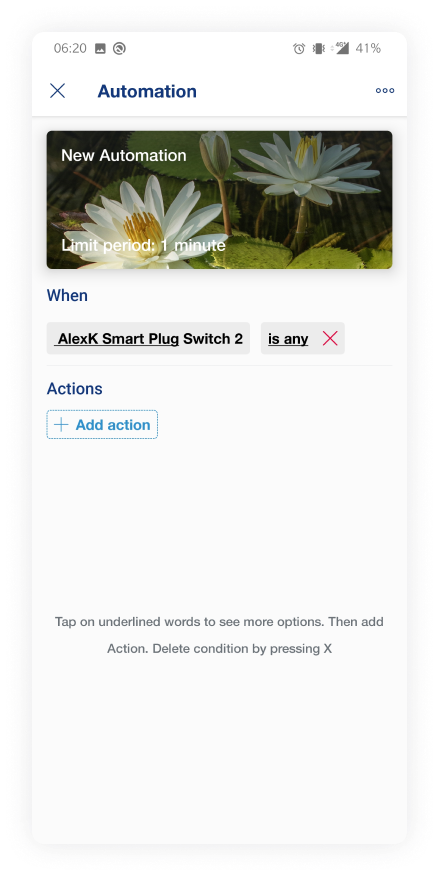

# Automations


Automations should be [enabled in Template settings](../web-dashboard/products/datastreams/datastreams-common-settings/automation.md) first. Otherwise Automation tab will be unavailable in Blynk.App


Tap **Add automation** to create a new one

Blynk currently supports 4 types of automations:

- **Time of Day** - allows you to trigger at a specific time of the day and for the specific day.
- **Sunset / Sunrise** - allows you to trigger at sunset/sunrise.
  This kind of automation is triggered based on the selected location.
  For the different locations you'll get the different sunset/sunrise time.
  Also, current sunset algorithm doesn't take into account the altitude of the selected region.
  So the sunset/sunrise time calculation may be not precise for the mountain regions.
- **Device state** - allows you to trigger based on the device datastream values. For example, if temperature > 40 degrees turn of the boiler
- **Scene** - allows to manually trigger multiple actions. For example, set the temperature to 30 degrees and turn off the alarm.
  The visibility of this type of the automation is controlled via permissions.


Automations can work across multiple devices


1. Create an Automation name
2. Choose cover picture
3. Set a condition that will trigger an automation

After setting the condition you **Add actions** that will be performed when the condition is triggered

After pressing Add action button you’ll see a modal with types of actions.

You can choose actions that will change the device’s state, send a notification to your smartphone or send an email to the specified address.

After adding the first action you can continue adding more of them or save this automation

When Automations are created you will see the list of them. Here you can disable/enable automations and open their settings for view and edit.

