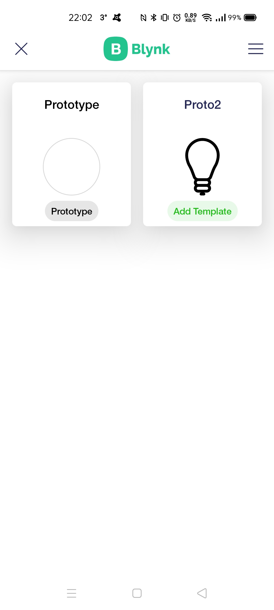

# Developer Mode

As a Developer you're able to create Blynk.App Templates in [Constructor](constructor/) directly on your mobile device.

## Enable the feature 

1. sign in
2. navigate to **My Profile**
3. toggle **Developer Mode** switch

Now you have access to Developer features.

## Linking the Templates

Tap **Wrench** pictogram at top right of the screen near to Menu pictogram

In Developer Mode screen you can set up Tiles for the Devices that will use Templates created in Blynk.360

1. tap Tile containing Add Template in it's bottom
2. select Template Tile Action Type and confirm by tap
3. set up Tile Icon, Interaction, Datastreams, Shape and other settings
4. tap X at top left to exit Tile Settings window and save the changes


If you need to edit the Tile, **hold** it for about a second.

Tap **Delete** button if you need to re-select Tile Interaction Type and repeat the actions from step 1 

Tap on Template Tile opens [**Constructor**](constructor/) from now on.


### Tile Types

There are 6 Devices tiles presets with different actions applied on tap : 

**Default** – views selected Datastream value in the tile \(e.g.: temperature, volume, percentage, etc.\) 

**Icon Button** – tap on the Device Tile will trigger an action or switch ON/OFF state

**Icon Level** – displays proportional level \(brightness, power, etc.\) based on selected Datastream value

**Color Brightness** – allows to view and edit Color, Power status and Brightness level of the Device

**Image** – shows Icon/Image on the Tile. No quick actions. It can be used for recognition purpose. 

**3 Labels** – it's a hybrid of Default and Icon Button. Up to 3 Datastream values display is supported

