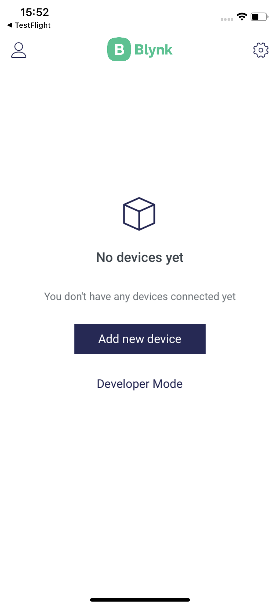

# Add new Device

## Link the device with Blynk.App

1. Tap **Add new device**

2. Make sure your device is powered on and waiting for connection.   
3. Tap **Ready**

4. **Choose your device** and tap it's name

### **iOS device connection:**

Once the **Ready** button is hit, the application tries to automatically connect to the device AP based on its hotspot prefix - **Blynk**. If connection is successful, the app goes straight to the **Connect your device** step. If unsuccessful \(e.g. because the device has different hotspot prefix\), the app presents with the instructions to go to the system settings and connect to the device manually:

* tap **Go to Settings;**
* select your Device in Wi-Fi settings
* return back to the Blynk application
* tap **Already connected;**
* if asked, **allow** Blynk application to connect to devices in your local network;
* proceed with common add device **flow**

\*\*\*\*

*   ****  _\*\*_

## **Connect your device to Blynk.Cloud**

Once the app is connected to the device, the next step is to send to the device the wifi credentials for it to use.

1. tap **Choose Wi-Fi network** and select the network your mobile device is connected to;
2. type selected Wi-Fi password; 
3. there's an option to **Remember this network** f**or other devices** – enabling it helps to save time if you need to add many devices. 
4. tap **Continue.**


Your smartphone will connect to the device and transfer the credentials, consequently, the device will try to connect to the internet and subsequently to the Cloud.


## **Device profiling**


Once your device is successfully connected to the internet and the cloud, you can rename it to differentiate from the others. 


1. Tap **Done**

2. Follow the on-screen steps to create Device profile


Check the device information to be correct on the Review screen. If something has to be changed you can edit it here by taping the field you need to edit. 


3. Tap **Apply** once all is fine


Profile is created.


4. Confirm by tapping **Continue**

## **Finalizing setup**

There’s one last screen of the provision process. 3 options are here:

* **Add new device** – add and setup completely new device;
* **Add new device and apply most recent profile/metadata** – our advice is to give devices different names;
* **Exit to app** – end device adding process and proceed to using it.

