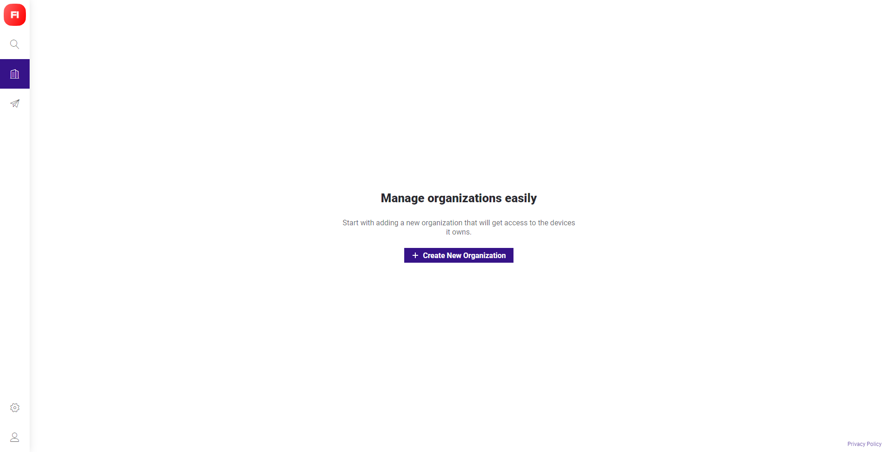
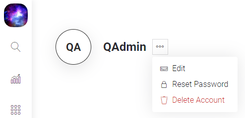
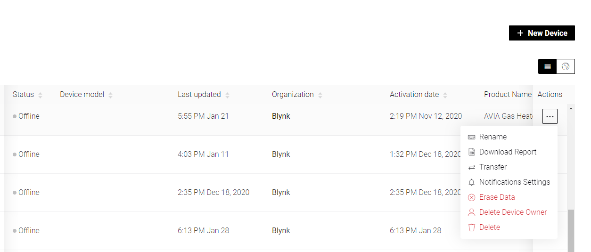
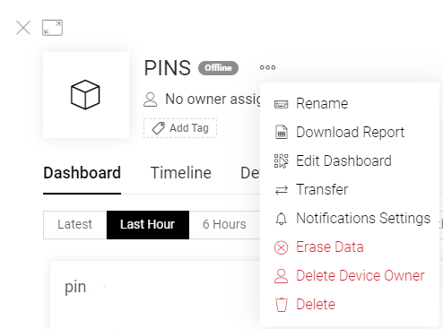
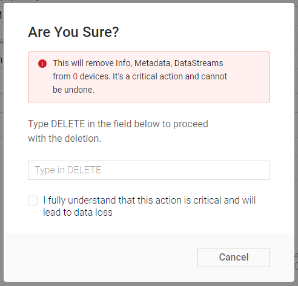

# Common Blynk.360 Navigation and Actions

## Global Navigation Menu. 

The **menu** is located on the left edge of the application and it's accessible any time and almost any place excepts for open modal windows.

Clicking on a menu item will lead to a specific section of Blynk.360  
Menu sections:

* Organization Logo \(can be changed in [Organization Settings](../../web-dashboard/for-developers/settings/organization-settings/general.md)\)
* [Search](../../web-dashboard/for-developers/search/)
* [Analytics](../../web-dashboard/for-developers/analytics.md)
* [Products / Templates](../../web-dashboard/for-developers/products/)
* [Organization](../../web-dashboard/for-developers/organizations.md)
* [Blynk.Air](../../web-dashboard/for-developers/blynk.air/)
* [Rule Engine](../../web-dashboard/for-developers/rule-engine.md)
* [Settings](../../web-dashboard/for-developers/settings/)
* [User Profile](../../web-dashboard/for-developers/user-profile.md)

**Note:** if some sections buttons are missing contact your Organization administrator.

## Create

**Create** button is located in the upper right corner and has different names depending on the section is opened at the moment \(**+ New Device** in Devices section, **+ Invite New User** in Users section, etc..\)

Also it has screen center location if no entities are present_:_

\_\_

_Action:_ 

* **Create** the entitty of the selected section

## Save / Cancel

This group of buttons is located in the upper right corner when in Create or Edit mode.

_Actions:_

* **Save** button – saves changes on the form
* **Cancel** button – cancels changes on the form
* **Delete** button \(available in Products and Organizations edit modes\)– deletes selected entity

## Actions Menu

Actions Menu button is located near a specific entity, e.g.: devices, user, table rows.   
When you hover the context menu icona pop-up menu appears with items \(actions\) that can be performed on this entity.

Locations examples:   

## Modal windows 

Modal windows are used for editing, displaying, deleting information or entities. 

They can be of 2 types: 

* Create or Edit 
* Take Critical Actions

Modals have the following structure:

* **Title** – describes the context of the actions in which the modal is open, e.g.: Edit Device, Delete User
* **Warning \(optional\)** – note about the action is critical and it's impacts description 
* **Body** – displays form elements and other information. 
* **Buttons area** – in most cases contains Save / Cancel buttons group. Optional: Delete, Transfer

## Tables

Table is the main type of data display in Blynk.360. 

Table contents and actions:

* **Column headings**
* **Table rows** – entity data display
* Also, the table has the ability to sort and filter the elements of the table.
  * **Sorting** – clicking the column heading you can sort the items in the table;
  * **Filtration –** click on the filter icon to filter the elements in the table by the specified parameter:

* **Copy an item** – there's an option to copy to the clipboard some elements:

* **Actions column** – context menu containing the actions that can be applied to a selected entity

* **Multiple choice** – click on the checkbox in the first column \(after hover an entity logo\) allows you to select several elements and apply bulk actions \(for example, delete\) by selecting the desired item from the context menu.

* **Switch to entity display**  – click on an element of the table to the display the entity

