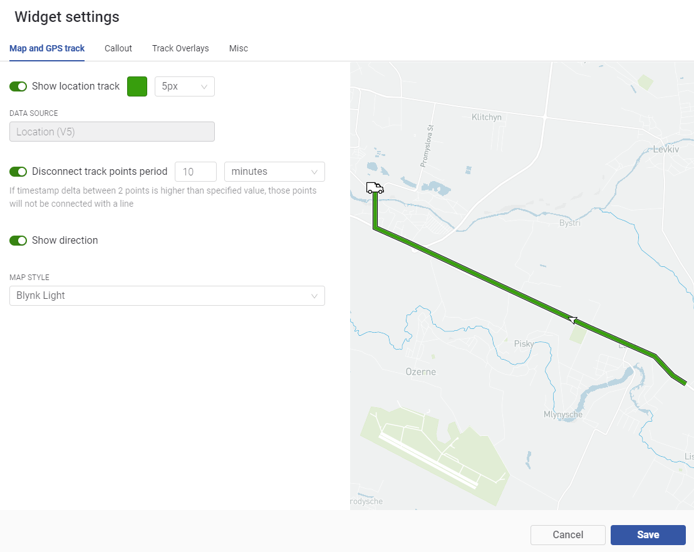

# Map

Map widget vizualises data related to a location of the device:

* Current or latest known location of the device 
* GPS track \(historical position of the device\)
* Overlays: various data related to the time and location of the device. E.g. speed of the device at a particular point of the track.


Location update in real time is not yet implemented. Refresh the page to see the latest location.


### Map Settings



* **Show location track** – enable it to view the whole route. Otherwise only track points and direction will be displayed. **Color** and **line thickness pickers** are available for the Track.
* **Disconnect track points period** – enable it in case you need to split the track if timestamp delta between 2 points is higher than specified value.
* **Show direction** – enabling this option will show the arrows on the Track to ease the understanding of it's direction.
* Map Style – select the one you find the best for your purposes. 7 styles are available now:
  * Streets
  * Outdoors
  * Light
  * Dark
  * Satellite
  * Satellite+Streets
  * Blynk Light

### Callout


Callout is used to view specified Datastreams' value that was actual at the place and time selected by user in Map Widget.

* **Add Value** – click this button to search and select for any Datastream you want to show in Callout window.
* **Move** – hover on the previosly added Datastream panel for action buttons to appear. Hold Move button and change the position of Callout Value, release mouse button, repeat with other panels once you find it fine.
* **Delete** – hover on the previosly added Datastream panel for action buttons to appear. Click Delete button \(no confirmation is applied here\)

### Track Overlays

### Misc

Here you can set up Device's **actual track point design**.

Select one of 4 track point styles:

* Point
* Course
* Truck
* Device name

Select Datastream that contains course information in degrees \(e.g. it gets it from Device's compass\) so the track point can **show course direction** \(this feature is supported by Course and Truck point styles\)


## Insert the data

Let's say we have the Location Datastream assigned to the Virtual Pin 5. For the map you can update the data from the hardware:

```text
Blynk.virtualWrite(V5, longtitude, latitude);
```

Also, you can insert the data via HTTPS API:

```text
https://{server_address}/external/api/update?token={token}&V5=longtitude&V5=latitude
```

You can also send multiple datastreams within the same request. In that case these datastreams would be displayed in the callout with the same timestamp:

```text
https://{server_address}/external/api/batch/update?token={token}&V5=longtitude&V5=latitude&V6={somevalue}
```


Please pay attention to the order of the coordinates. `Longtitude` should always go first.


