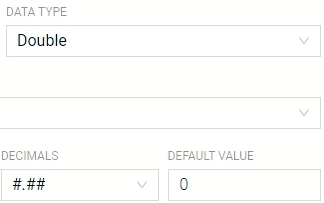

# Data Type

Every Datastream has a data type. Data type is used to optimize the data storage and calculations.

Currently there are 3 supported data types:

* `Integer` \(-2,147,483,648 to 2,147,483,647\)
* `Double` \(1.7976931348623157 x 10^308 to 4.9406564584124654 x 10^-324\)
* `String` \(any value is accepted\)

It is very important to select the correct type for your Datastream. As values that doesn't match the data type are ignored.

For example, let's assume we have the data stream with data type `Integer`. Hardware via `Blynk.virtualWrite` sends string `123.0`. Server will skip this value, because it is Floating point value and not `Integer`. Hardware have to send `123` if you want this values to be accepted or change the type of the Datastream to `Double`.

