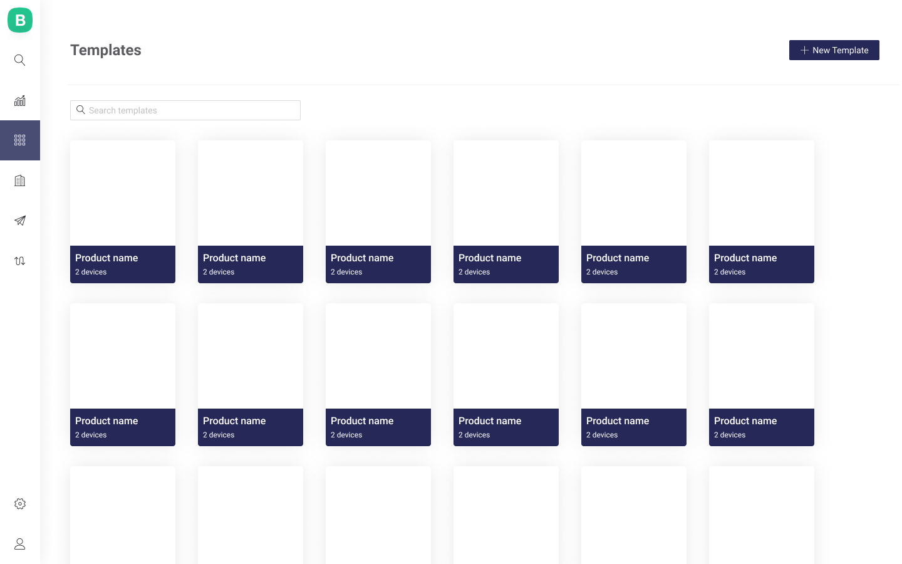

# Working With Templates

## Create a Template

1. Click **New Template** button to start configuring the Template
2. Provide basic Template info in modal window opened
3. Fill [Info](info/), [Metadata](metadata/), [Datastreams](datastreams/), [Events ](events/)and [Dashboard ](dashboard/)tabs contents 
4. Click **Save** once you've finished the setup.

## Edit a Template

Click Product **tile** to view the Template.  
Here you can navigate through **tabs**. **Edit** and **Clone** options are available.

## Delete a Template


This is a critical action that can affect how your devices and application work


1. Open Template 
2. Click **Edit** in the top right corner
3. Click **Delete** button
4. A confirmation dialogue will appear
5. Type **in DELETE** \(in caps\) in the confirmation field
6. Mark the checkbox to confirm that you understand the severity of this action
7. Click **DELETE**

## MOVE TO ORGANIZATION CREATION: Share Template to an Organization

1. Navigate to **Organization tab** \(left menu\)
2. Open Organization with **click on it's tile**
3. Navigate to Organization's **Templates** tab
4. Templates tile screen will open
5. Click **Edit** 
6. **Click tiles** to add/remove Templates. Active Templates are marked with green tick, disabled have tiles with reduced colors. 
7. Once the changes are made click **Save**.

