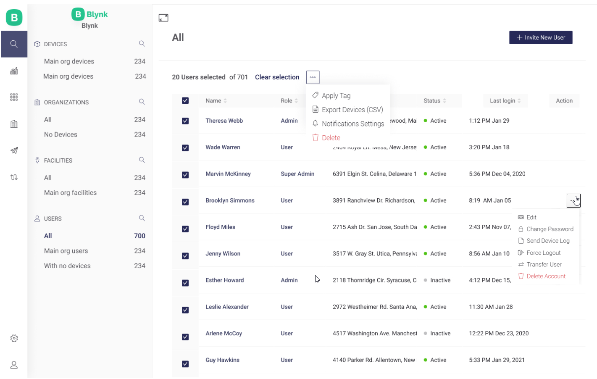
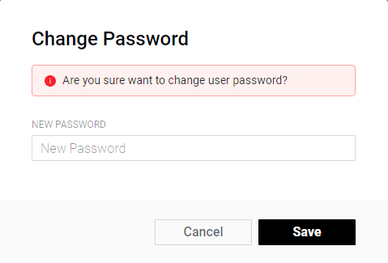
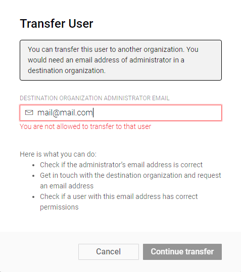

# List of Users

## Users table

This table shows the Organization's users information:

* **Name** – user's name and last name \(optional\) that was assigned to User during invitation or sign up
* **Role** – displays one of  3 roles available: **Admin, Staff, User** with different [access and permissions](../../settings/access.md).
* **Location** – displays location user was assigned to during invitation or sign up
* **Status** – 3 registration statuses are possible:
  * **pending** – the user is invited, but the email is not confirmed \(user haven't logged in\) 
  * **active** – the user confirmed the email, logged at least one time 
  * **inactive** – the user hasn't logged for 1 month
* **Last login** – last time user logged in hh:mm M D, Y format \(year is hidden if it's current\)
* **Actions-**displays a menu of actions that can be applied to this User: Edit, 

  Change Password, Send Device Log, Force Logout, Transfer User, Delete Account.

### Table interaction

All the columns support sorting.

Role and Status columns support additional filtering option.  
Select desired option\(s\) from the menu appears on clicking filter icon and press OK in order to change the table view. Click reset in the same menu if you want to return to default table view.

#### Hover options:

* **Initials** – shows check bocks allowing to select the user for further Bulk Actions
* **Name** – opens Email containing hint. Click on it to copy user's Email address
* **User role** – click opens [Role Permissions list](../../settings/access.md) on the right part of the screen  

The  **Bulk Action** available here is to Apply Tag, Export Users \(CSV\) and Delete the users. 

### **Apply Tag**

1. Select all users by marking **checkbox** in columns naming row or specify users selection by marking each user's checkbox.
2. Once users selection is made **Apply Tag** button appears on the top right of the screen.
3. In the modal window that appears, select **a Tag** from **the List of Tags.**
4. Confirm or cancel the action

### Export Users \(CSV\)

1. Select all users by marking **checkbox** in columns naming row or specify users selection by marking each user's checkbox.
2. Once users selection is made **Export Users \(CSV\)** button appears on the top right of the screen.
3. File is ready You can download it now.
4. Confirm or cancel the action

### Notifications Settings

1. Select all users by marking **checkbox** in columns naming row or specify users selection by marking each user's checkbox.
2. Once users selection is made **Notifications Settings** button appears on the top right of the screen.
3. 

### Delete the users

1. Select all users by marking **checkbox** in columns naming row or specify users selection by marking each user's checkbox.
2. Once users selection is made **Delete** button appears on the top right of the screen.
3. Don't worry, there's a prompt  "Are You Sure You Want To Delete Selected Users?" with **Cancel** and **Yes, Delete** buttons.
4. Confirm or cancel the action 

**Single Actions** menu is triggered by hovering Actions column in user's row. Available actions:

* **Edit** – edit data that was provided during invitation. Same modal window as for Invite User. Email can't be changed.
* **Change Password** – modal window opens.  "Are you sure want to change user password?" prompt NEW PASSWORD input field.

* **Send Device Log** – sends selected user's devices logs to Administrator's Email
* **Force Logout** – logs user out immediately. No confirmations required.
* **Transfer User** – you can transfer this user to another organization. You would need to input an email address of administrator in a Destination Organization Administrator Email field.

* **Delete Account** – modal window will appear. Type DELETE and confirm the action are required.

### 

## Filters

## Actions

## Invite New User

